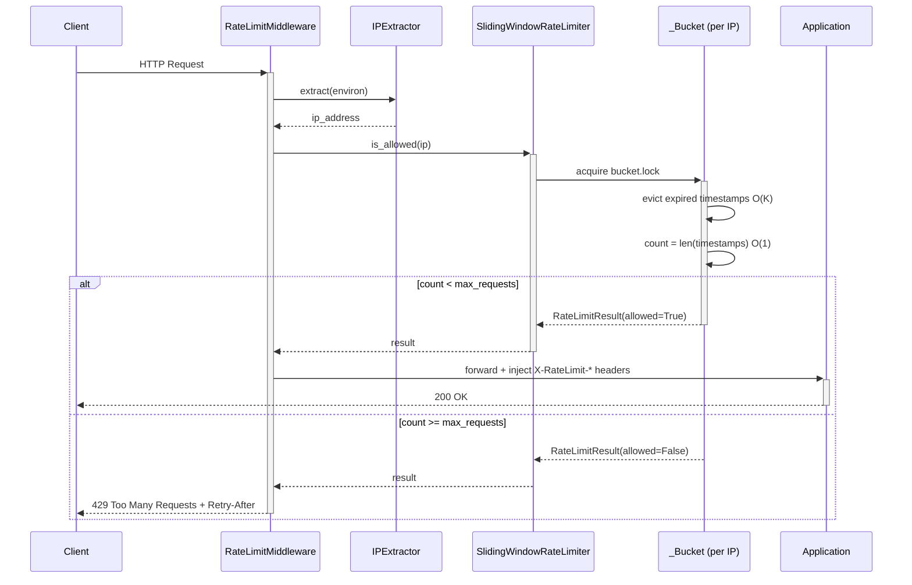

# Python Rate Limiter


SRE-grade middleware that protects APIs from DDoS and abuse using the **Sliding Window Log** algorithm. The core engine has zero external dependencies and integrates with any WSGI application as a drop-in wrapper.

---

## Features

- **Precise algorithm** — Sliding Window Log eliminates the boundary-burst artifact that Token Bucket allows at window edges
- **Thread-safe** — two-level locking (global dict lock + per-IP bucket lock) with strict acquisition order to prevent deadlocks
- **Bounded memory** — three layers of protection: `deque(maxlen)`, LRU eviction cap, and a background cleanup daemon
- **Drop-in WSGI middleware** — wraps Flask, Django, Falcon, or any WSGI app in one line
- **Standard HTTP headers** — `X-RateLimit-Limit`, `X-RateLimit-Remaining`, `X-RateLimit-Reset`, `Retry-After`
- **Tested** — 43 tests covering concurrency, memory pressure, IP extraction, and config validation

---

## Architecture



---

## The Algorithm: Why Sliding Window Log?

**Token Bucket** is great for CDN burst modeling but has a known flaw called **boundary burst**: a client can exhaust tokens just before the window resets and immediately consume more tokens after the reset, effectively doubling the allowed rate at the boundary.

**Sliding Window Log** ties every request to a real timestamp. The window slides continuously with time — there is no reset instant to exploit.

```
Sliding Window Log — 5 requests / 10 seconds

t = 0s                                           t = now
 |--------------------------------------------------|
       [r1]  [r2]              [r3]  [r4]  [r5]
        ^                                     ^
   (expired)                               (recent)
        |<-------- window_start = now - 10s ------->|

On the next request:
  r1 and r2 are < window_start  →  evicted (popleft, O(1) each)
  count = 3  →  3 < 5  →  ALLOW

Without eviction:
  count = 5  →  5 >= 5  →  DENY 429
```

### Complexity

| Operation | Time | Space |
|---|---|---|
| `is_allowed()` | O(K) amortised, K = expired entries evicted | O(R) per IP |
| Full limiter | — | O(I × R), I = active IPs, R = max_requests |
| `_evict_stale_ips()` | O(I) | O(I) |
| `_evict_lru_under_lock()` | O(I) | O(1) |

In steady state K ≈ 0, making `is_allowed()` effectively **O(1)**.

---

## Quick Start

### 1. Install

```bash
pip install flask          # only needed for the example server
# core engine (rate_limiter.py + middleware.py) has zero dependencies
```

### 2. Wrap your Flask app

```python
from flask import Flask, jsonify
from rate_limiter import RateLimitConfig, SlidingWindowRateLimiter
from middleware import RateLimitMiddleware

app = Flask(__name__)

limiter = SlidingWindowRateLimiter(RateLimitConfig(
    max_requests=100,       # requests allowed per window
    window_seconds=60,      # window duration in seconds
    cleanup_interval=120,   # how often idle IPs are purged (seconds)
    max_ips=50_000,         # hard RAM cap — protects against IP spoofing
))

app.wsgi_app = RateLimitMiddleware(app.wsgi_app, limiter)

@app.route("/api/data")
def data():
    return jsonify({"result": "ok"})
```

### 3. Use directly (no HTTP required)

```python
from rate_limiter import RateLimitConfig, SlidingWindowRateLimiter

limiter = SlidingWindowRateLimiter(RateLimitConfig(
    max_requests=5, window_seconds=10,
    cleanup_interval=60, max_ips=10_000,
))

result = limiter.is_allowed("203.0.113.42")

if result.allowed:
    print("Request allowed. Headers:", result.headers)
else:
    print("Rate limited. Retry-After:", result.headers["Retry-After"])
```

---

## Configuration

| Field | Type | Description |
|---|---|---|
| `max_requests` | `int` | Maximum requests allowed within the window |
| `window_seconds` | `float` | Sliding window duration in seconds |
| `cleanup_interval` | `float` | How often the daemon sweeps idle IPs (seconds) |
| `max_ips` | `int` | Hard cap on tracked IPs — triggers LRU eviction when reached |

All fields are validated on construction. Passing `0` or a negative value raises `ValueError` immediately.

---

## HTTP Response Headers

Every response (200 and 429) includes:

| Header | Description |
|---|---|
| `X-RateLimit-Limit` | Maximum requests allowed in the window |
| `X-RateLimit-Remaining` | Slots remaining in the current window |
| `X-RateLimit-Reset` | Seconds until the window resets |
| `Retry-After` | *(429 only)* Seconds the client should wait before retrying |

**200 OK — within limit:**
```http
HTTP/1.1 200 OK
X-RateLimit-Limit: 5
X-RateLimit-Remaining: 3
X-RateLimit-Reset: 10.00
Content-Type: application/json

{"msg": "ok"}
```

**429 Too Many Requests — limit exceeded:**
```http
HTTP/1.1 429 Too Many Requests
X-RateLimit-Limit: 5
X-RateLimit-Remaining: 0
X-RateLimit-Reset: 7.43
Retry-After: 8
Content-Type: application/json; charset=utf-8

{
  "error": "Too Many Requests",
  "message": "Limit of 5 requests per 10s exceeded.",
  "retry_after": "8"
}
```

---

## Memory Safety

A naive rate limiter stores every IP that ever made a request — forever. Under an IP-spoofing attack this causes unbounded RAM growth.

This implementation uses three independent layers:

```
Layer 1 — deque(maxlen=max_requests)
  Enforced per bucket at append time.
  Guarantees O(max_requests) space per IP regardless of burst size.

Layer 2 — LRU eviction  (_evict_lru_under_lock)
  Triggered when len(_buckets) == max_ips.
  The least-recently-used IP is removed before the new one is inserted.
  The dict never exceeds max_ips entries.

Layer 3 — Background cleanup daemon  (_evict_stale_ips)
  Runs every cleanup_interval seconds.
  Removes IPs idle for more than 2 × window_seconds.
  Prevents legitimate short-lived clients from accumulating forever.
```

---

## Concurrency

When multiple requests from the same IP arrive simultaneously, a naive implementation has a race condition:

```
Thread A: reads count=4  →  decides "allow"
Thread B: reads count=4  →  decides "allow"  (before A writes)
Result:   deque grows to 6  →  silent limit violation
```

This implementation uses **fine-grained per-IP locking**. The read-check-write sequence is atomic within each bucket:

```
Thread A: acquires bucket.lock → reads count=4 → appends → releases
Thread B: waits              → acquires lock  → reads count=5 → denies
Result:   exactly max_requests pass through — guaranteed
```

IPs that don't share requests never contend — no global serialisation.

---

## Running Locally

```bash
# Clone and enter the project
git clone https://github.com/kayque-silva/python-rate-limiter.git
cd python-rate-limiter

# Install dependencies
pip install flask

# Start the server
python server.py
```

The server exposes three endpoints:

| Endpoint | Description |
|---|---|
| `GET /api/hello` | Example rate-limited endpoint |
| `GET /stats` | Live limiter metrics (tracked IPs, config) |
| `GET /health` | Lightweight health check |

**Test the rate limit from the terminal:**

```bash
# PowerShell — fire 6 requests (limit is 5 / 10s)
for ($i = 1; $i -le 6; $i++) {
    try {
        $r = Invoke-WebRequest http://localhost:5000/api/hello -UseBasicParsing
        "Req $i -> $($r.StatusCode)  remaining=$($r.Headers['X-RateLimit-Remaining'])"
    } catch {
        "Req $i -> 429 BLOCKED"
    }
}
```

```
Req 1 -> 200  remaining=4
Req 2 -> 200  remaining=3
Req 3 -> 200  remaining=2
Req 4 -> 200  remaining=1
Req 5 -> 200  remaining=0
Req 6 -> 429 BLOCKED
```

**Live metrics at `/stats`:**

```json
{
  "uptime_seconds": 42.3,
  "tracked_ips": 1,
  "max_ips_cap": 10000,
  "config": {
    "max_requests": 5,
    "window_seconds": 10
  }
}
```

---

## Running the Demo

The demo runs four progressive scenarios with no dependencies beyond the stdlib:

```bash
python demo.py
```

```
Rate Limiter - Sliding Window Log - Demo
============================================================

------------------------------------------------------------
  Scenario 1 - Basic allow / deny  (5 req / 2s)
------------------------------------------------------------
  [OK  ] Req 1/5 -> ALLOWED  (remaining=4)
  [OK  ] Req 2/5 -> ALLOWED  (remaining=3)
  [OK  ] Req 3/5 -> ALLOWED  (remaining=2)
  [OK  ] Req 4/5 -> ALLOWED  (remaining=1)
  [OK  ] Req 5/5 -> ALLOWED  (remaining=0)
  [OK  ] Req 6/5 -> 429 BLOCKED  (Retry-After=3s)
  [OK  ] Different IP (10.0.0.1) -> ALLOWED  (buckets are independent)
  [....] Waiting for window to expire (2.1s)...
  [OK  ] After window reset -> ALLOWED again  (remaining=4)

------------------------------------------------------------
  Scenario 2 - Race condition  (50 threads, limit=10)
------------------------------------------------------------
  [....] 50 simultaneous threads, same IP
  [....] Allowed: 10  |  Blocked: 40
  [OK  ] Exactly 10 requests allowed -- no race condition
  [OK  ] Internal state consistent (1 bucket tracked)

------------------------------------------------------------
  Scenario 3 - Memory pressure  (cap=100 IPs, injecting 500)
------------------------------------------------------------
  [....] IPs injected: 500  |  IPs in dict: 100  |  Cap: 100
  [OK  ] Dict bounded to 100 entries (<= 100) -- no memory leak

------------------------------------------------------------
  Scenario 4 - Cleanup daemon  (window=1s, interval=1.5s)
------------------------------------------------------------
  [....] IPs tracked before cleanup: 10
  [....] Waiting for daemon sweep (3.5s)...
  [....] IPs tracked after cleanup:  0
  [OK  ] Daemon evicted 10 idle IPs
  [OK  ] Active IP survived the cleanup sweep

All scenarios completed successfully.
```

---

## Running Tests

```bash
pip install pytest pytest-cov
python -m pytest -v
```

```
============================= test session starts =============================
platform win32 -- Python 3.10.0, pytest-8.2.2
testpaths: tests

tests/test_middleware.py::TestPassThrough::test_returns_200_within_limit PASSED
tests/test_middleware.py::TestPassThrough::test_returns_429_after_limit_exceeded PASSED
tests/test_middleware.py::TestPassThrough::test_body_429_is_valid_json PASSED
tests/test_middleware.py::TestPassThrough::test_rate_limit_headers_present_on_200 PASSED
tests/test_middleware.py::TestPassThrough::test_rate_limit_headers_present_on_429 PASSED
tests/test_middleware.py::TestPassThrough::test_content_type_on_429_includes_charset PASSED
tests/test_middleware.py::TestPassThrough::test_downstream_headers_are_preserved PASSED
tests/test_middleware.py::TestIPExtractionIntegration::test_xff_takes_priority_over_remote_addr PASSED
tests/test_middleware.py::TestIPExtractionIntegration::test_xff_multi_value_uses_first_ip PASSED
tests/test_middleware.py::TestIPExtractionIntegration::test_x_real_ip_used_when_xff_absent PASSED
tests/test_middleware.py::TestIPExtractionIntegration::test_trust_proxy_false_ignores_xff PASSED
tests/test_middleware.py::TestIPExtractor::test_remote_addr_returned_when_no_proxy_headers PASSED
tests/test_middleware.py::TestIPExtractor::test_xff_takes_priority PASSED
tests/test_middleware.py::TestIPExtractor::test_xff_multi_value_returns_first PASSED
tests/test_middleware.py::TestIPExtractor::test_xff_strips_whitespace PASSED
tests/test_middleware.py::TestIPExtractor::test_x_real_ip_used_when_no_xff PASSED
tests/test_middleware.py::TestIPExtractor::test_xff_has_priority_over_x_real_ip PASSED
tests/test_middleware.py::TestIPExtractor::test_trust_proxy_false_ignores_all_proxy_headers PASSED
tests/test_middleware.py::TestIPExtractor::test_fallback_when_remote_addr_missing PASSED
tests/test_rate_limiter.py::TestAllow::test_permits_requests_within_limit PASSED
tests/test_rate_limiter.py::TestAllow::test_blocks_request_over_limit PASSED
tests/test_rate_limiter.py::TestAllow::test_ip_isolation PASSED
tests/test_rate_limiter.py::TestAllow::test_allows_again_after_window_expires PASSED
tests/test_rate_limiter.py::TestAllow::test_expired_requests_do_not_count PASSED
tests/test_rate_limiter.py::TestHeaders::test_remaining_decrements_each_request PASSED
tests/test_rate_limiter.py::TestHeaders::test_limit_header_matches_config PASSED
tests/test_rate_limiter.py::TestHeaders::test_reset_header_is_positive PASSED
tests/test_rate_limiter.py::TestHeaders::test_retry_after_present_when_denied PASSED
tests/test_rate_limiter.py::TestHeaders::test_retry_after_absent_when_allowed PASSED
tests/test_rate_limiter.py::TestHeaders::test_remaining_is_zero_on_last_allowed_request PASSED
tests/test_rate_limiter.py::TestConcurrency::test_no_race_condition_same_ip PASSED
tests/test_rate_limiter.py::TestConcurrency::test_distinct_ips_do_not_block_each_other PASSED
tests/test_rate_limiter.py::TestMemory::test_ip_cap_is_never_exceeded PASSED
tests/test_rate_limiter.py::TestMemory::test_flush_stale_removes_idle_ips PASSED
tests/test_rate_limiter.py::TestMemory::test_active_ip_survives_flush PASSED
tests/test_rate_limiter.py::TestMemory::test_stats_tracked_ips_increments_on_new_ip PASSED
tests/test_rate_limiter.py::TestConfig::test_invalid_config_raises[max_requests-0] PASSED
tests/test_rate_limiter.py::TestConfig::test_invalid_config_raises[max_requests--1] PASSED
tests/test_rate_limiter.py::TestConfig::test_invalid_config_raises[window_seconds-0] PASSED
tests/test_rate_limiter.py::TestConfig::test_invalid_config_raises[window_seconds--5.0] PASSED
tests/test_rate_limiter.py::TestConfig::test_invalid_config_raises[max_ips-0] PASSED
tests/test_rate_limiter.py::TestConfig::test_invalid_config_raises[max_ips--100] PASSED
tests/test_rate_limiter.py::TestConfig::test_stats_contains_expected_keys PASSED

============================== 43 passed in 3.94s ==============================
```

With coverage report:

```bash
python -m pytest --cov --cov-report=term-missing
```

---

## Project Structure

```
python-rate-limiter/
│
├── rate_limiter.py        # Core engine — RateLimitConfig, RateLimitResult,
│                          #   SlidingWindowRateLimiter, _Bucket
├── middleware.py          # WSGI middleware — IPExtractor, RateLimitMiddleware
├── server.py              # Flask example server (/api/hello, /stats, /health)
├── demo.py                # Four standalone scenarios (no HTTP server required)
│
├── tests/
│   ├── conftest.py        # Shared pytest fixtures
│   ├── test_rate_limiter.py   # Unit tests (algorithm, headers, concurrency, memory)
│   └── test_middleware.py     # Integration tests (WSGI) + IPExtractor unit tests
│
├── .github/
│   └── workflows/
│       └── tests.yml      # CI: Python 3.10 / 3.11 / 3.12 on push and PR
│
├── pyproject.toml         # Project metadata, dependencies, pytest and coverage config
├── LICENSE                # MIT
└── .gitignore
```

---

## Design Decisions

**Why not Redis?**
Redis-based rate limiters are production-standard for multi-process deployments but add operational overhead (Redis cluster, network latency, connection pooling). This implementation demonstrates the algorithm and data structures from scratch — the same logic underpins Redis-based solutions.

**Why per-IP locks instead of a global lock?**
A single global lock serialises all requests regardless of origin. With per-IP locks, requests from different IPs proceed in parallel and only requests from the **same IP** contend with each other, which is exactly the right granularity.

**Why `deque(maxlen)` instead of a plain list?**
`deque.popleft()` is O(1). `list.pop(0)` is O(N) because it shifts all elements. With high `max_requests` values the difference is significant.

---

## License

[MIT](LICENSE) — Kayque Silva, 2026
